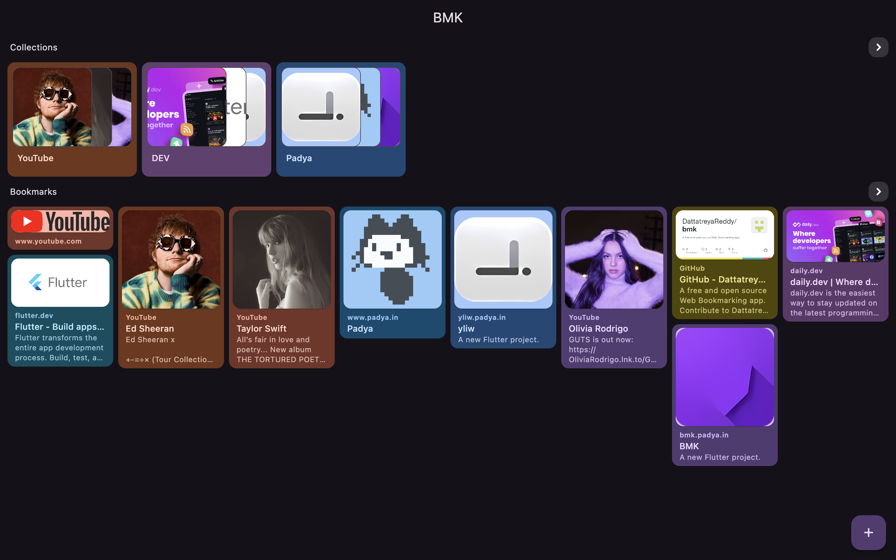
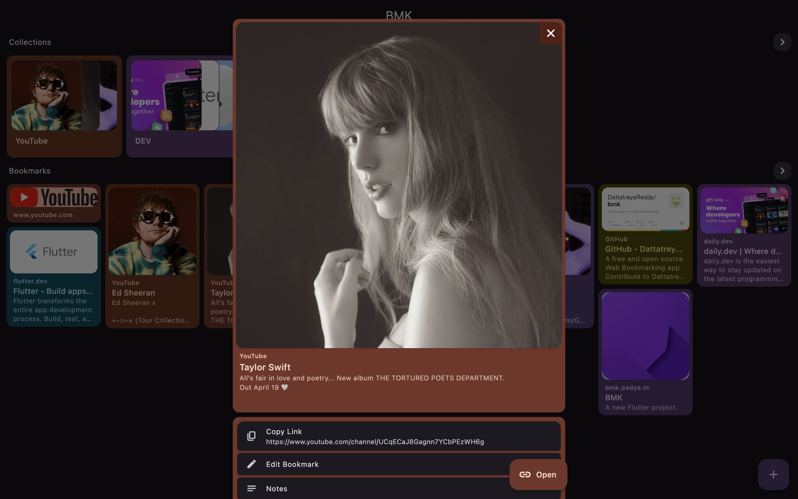

<p align="center">
 
</p>

<h3 align="center"> BMK </h3>


<div align="center">

[][release]
</div>

<div align="center">

[](https://github.com/DattatreyaReddy/bmk)
[](https://github.com/DattatreyaReddy/bmk/blob/main/LICENSE)

[](https://github.com/DattatreyaReddy/bmk/releases)

</div>


<p align="center">
A free and open source Web Bookmarking app.</br>
BMK supports Linux, Windows, MacOS, Web, iOS and Android.
</p>

---


<div align="center">
  <h3> Preview </h3>
  
  
</div>


## Downloading and Running the app

### Android

Download *-android-all.apk file from latest release [the releases section][release].


### iOS

- Download the latest .ipa file from [the releases section][release]
- use [AltStore](https://altstore.io/) to install BMK in ios.

### Windows

Download the latest .msi file from [the releases section][release].

<!-- if you use WINGET, you can run
```
winget install bmk
``` -->

### MacOS

- Download the *-macos-x64.zip from the latest release [the releases section][release]
- Extract the file.
- Drag and drop the extracted app file to applications folder in finder.

<!-- if you use HomeBrew, you can run
```
brew install --cask bmk
``` -->

### Debian based Linux

Download the latest deb release from [the releases section][release].

<!-- ### Arch based Linux

Download the latest release from [the aur](https://aur.archlinux.org/packages/bmk-bin).

If you use yay, you can run
```
yay -S bmk-bin
```
inside a terminal window. -->

### Web

Download the latest web.zip file from [the releases section][release].

- BMK-web deployed in GitHub pages. You can check out [BMK here](https://bmk.padya.in).


## Building from source

These instructions will get you a copy of the project up and running on your local machine for development and testing purposes.

### Prerequisites

You can install Flutter & Dart from [Official website](https://docs.flutter.dev/get-started/install)

  - Dart sdk
  - Flutter - Channel Stable

### Building

1.  Clone the repository:

```
  $ git clone https://github.com/DattatreyaReddy/bmk.git
  $ cd bmk/
```
2.  You can install all dependencies by running this command in terminal:

```
  $ flutter pub get
```
3.  Localization generator
```
  $ flutter gen-l10n
```
3.  Build Runner Files Generator
```
  $ dart run build_runner build
```

3.  Now enter the following command to start debugging the app:

```
  $ flutter run
```


- Pull-Request Suggestion
  - Install GitHooks after cloning the repo using `git config --local core.hooksPath .githooks`

## Support and help

-   Raise issue in github

## Built Using

- [Flutter](https://flutter.dev/) is an open source framework by Google for building beautiful, natively compiled, multi-platform applications from a single codebase.

- [Flutter Riverpod](https://pub.dev/packages/riverpod/) - A simple way to access state while robust and testable.

Find other dependencies in [pubspec.yaml](pubspec.yaml)

## Credit

- The `BMK` project is developed by [@DattatreyaReddy](https://github.com/DattatreyaReddy) and contributors.

<!-- ## Translation
Feel free to translate the project on [Weblate](https://hosted.weblate.org/projects/DattatreyaReddy/bmk/)

<details><summary>Translation Progress</summary>
<a href="https://hosted.weblate.org/engage/padya/">

</a>
</details> -->

## License

You can obtain a copy of `Mozilla Public License v2.0` from https://mozilla.org/MPL/2.0/


    Copyright (c) 2024 Panta Dattatreya Reddy

    This Source Code Form is subject to the terms of the Mozilla Public
    License, v. 2.0. If a copy of the MPL was not distributed with this
    file, You can obtain one at http://mozilla.org/MPL/2.0/.


[release]: https://github.com/DattatreyaReddy/bmk/releases
[bmk]: https://github.com/DattatreyaReddy/bmk
